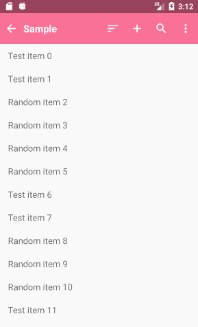
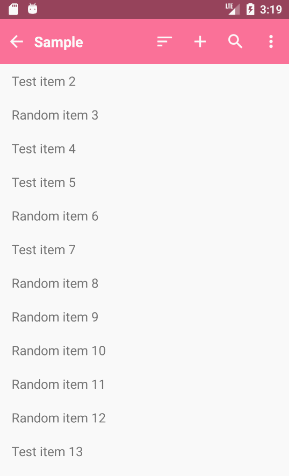

# JActionbar

## Download

```
dependencies {
    compile 'com.king.lib:jactionbar:1.0.1'
}
```

## Preview

    

## Sample

JActionbar support a way to parse menu xml resource to icons and popup items

define menu_sample.xml in menu folder under res

```
<?xml version="1.0" encoding="utf-8"?>
<menu xmlns:android="http://schemas.android.com/apk/res/android"
    xmlns:app="http://schemas.android.com/apk/res-auto">
    <item android:id="@+id/menu_sort"
        android:title="Sort"
        android:icon="@drawable/ic_sort_white_24dp"
        app:showAsAction="ifRoom"/>
    <item android:id="@+id/menu_add"
        android:title="Add"
        android:icon="@drawable/ic_add_white_24dp"
        app:showAsAction="ifRoom"/>
    <item android:id="@+id/menu_edit"
        android:title="Edit item"
        android:icon="@drawable/ic_edit_white_24dp"
        app:showAsAction="ifRoom"/>
    <item android:id="@+id/menu_delete"
        android:title="Delete items"
        android:icon="@drawable/ic_delete_white_24dp"
        app:showAsAction="ifRoom"/>
    <item android:id="@+id/menu_close"
        android:title="Exit"
        android:icon="@drawable/ic_close_white_24dp"
        app:showAsAction="ifRoom"/>
</menu>
```


use JActionbar like this

```
<com.king.app.jactionbar.JActionbar
    android:id="@+id/action_bar"
    android:layout_width="match_parent"
    android:layout_height="?android:attr/actionBarSize"
    android:background="@color/actionbar_bg"
    app:supportSearch="true"
    app:showIconBack="true"
    app:title="Sample"
    app:rippleColor="#33000000"
    app:iconSize="44dp"
    app:iconPadding="10dp"
    app:titleSize="18dp"
    app:maxShowIcon="4"
    app:menu="@menu/menu_sample"/>
```


| attributes    | value      | explaination                                                 |
| ------------- | ---------- | ------------------------------------------------------------ |
| maxShowIcon   | Integer    | define how many menu items can be shown as icon, others will be presented by popup items |
| supportSearch | boolean    | if true, there will be a search icon added to actionbar just in the most right or in the left of more icon, you can also call enableSearch() or disableSearch() in java codes |
| showIconBack  | boolean    | define whether to show arrow back in the left of title       |
| rippleColor   | color      | set the ripple color of action icons                         |
| iconSize      | dimenssion | set the size of action icons                                 |
| iconPadding   | dimenssion | set the padding of action icons                              |
| menu          | menu       | specific the menu resource, you can also call inflate(R.menu.xxx) in java codes |
| title         | string     | actionbar title                                              |
| titleSize     | dimenssion | title size                                                   |

listener for back icon

```
actionBar.setOnBackListener(new OnBackListener() {
    @Override
    public void onBack() {
        // TODO your operation
    }
});
```

listener for search

```
actionBar.setOnSearchListener(new OnSearchListener() {
    @Override
    public void onSearchWordsChanged(String words) {
        // TODO your operation
    }
});
```

listener for menu items

```
actionBar.setOnMenuItemListener(new OnMenuItemListener() {
    @Override
    public void onMenuItemSelected(int menuId) {
        switch (menuId) {
            case R.id.menu_add:
                break;
                ...
        }
    }
});
```

use confirm status

```
@Override
public void onMenuItemSelected(int menuId) {
    switch (menuId) {
            case R.id.menu_delete:
                actionBar.showConfirmStatus(menuId);
                break;
        }
}
```

```
actionBar.setOnConfirmListener(new OnConfirmListener() {
    @Override
    public boolean disableInstantDismissConfirm() {
        return false;
    }

    @Override
    public boolean disableInstantDismissCancel() {
        return false;
    }

    @Override
    public boolean onConfirm(int actionId) {
        switch (actionId) {
            case R.id.menu_delete:
            	break;
        }
        return true;
    }

    @Override
    public boolean onCancel(int actionId) {
        return onCancelAction(actionId);
    }
});
```


register popup menu for icon

```
actionBar.registerPopupMenu(R.id.menu_sort);
actionBar.setPopupMenuProvider(new PopupMenuProvider() {
    @Override
    public PopupMenu getPopupMenu(int iconMenuId, View anchorView) {
        if (iconMenuId == R.id.menu_sort) {
            return getSortPopup(anchorView);
        }
        return null;
    }
});
```